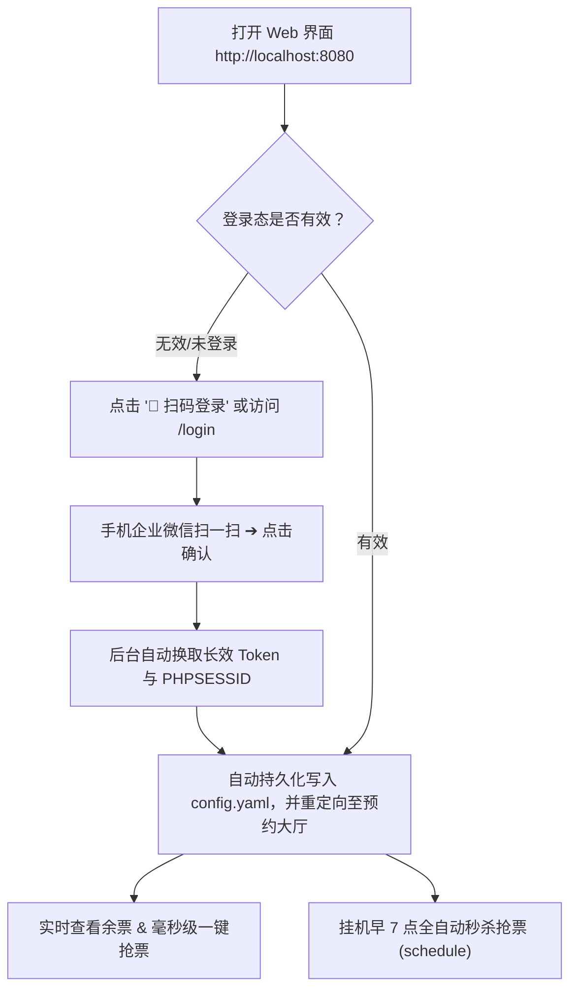
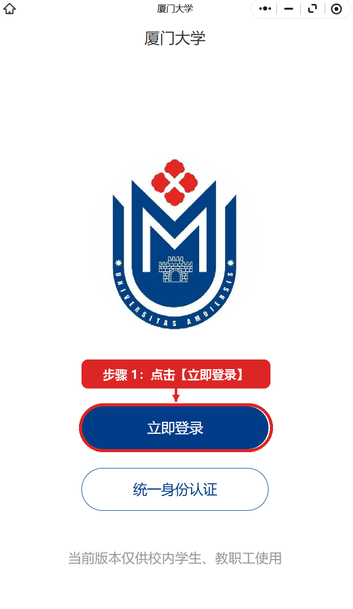
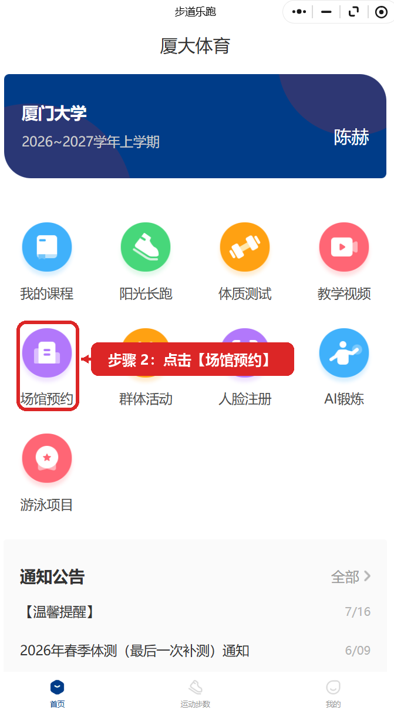

# 厦大体育馆自动预约工具 (XMU Gym Booking) 🏋️‍♂️

> 面向厦门大学师生的体育馆（翔安校区 / 思明校区健身房等）极速预约与早 7 点准点抢票工具。  
> **无需复杂抓包**，支持**网页直观预约**与**早 7 点全自动挂机秒抢**，零编程基础也能轻松上手！

---

## ✨ 核心功能亮点

- 🌐 **现代化 Web 控制台**：浏览器直观查看全天各时段已约/总名额进度条，余票状态一目了然，点选时段毫秒级一键预约。
- 📱 **纯 Python 企业微信扫码直通**：彻底脱离微信 PC 客户端与手动抓包！浏览器直出官方二维码，手机扫码授权后系统自动换发 ST 票据与长效凭证，自动持久化并直通预约大厅。
- 🔑 **微信免抓包智能嗅探**：支持本地代理安全嗅探，微信小程序点击即自动提取凭证并持久保活，告别手动抓包看 Cookie。
- ⏰ **早 7 点全自动秒杀抢票**：睡前挂机，次日早 06:55 自动自检自愈登录态，07:00:00 准点毫秒级并发秒抢次日名额。
- 🎯 **就近时段智能降级保护**：若首选黄金时段瞬间被抢空，算法自动就近抢最相邻的可用时段，绝不空手而归。
- 🔄 **退票捡漏秒级回捞**：热门时段已约满？开启捡漏监听模式，一旦有人退票出空位立即毫秒级自动秒抢。
- 📱 **微信即时推送提醒**：抢票成功后手机微信秒弹卡片通知，场馆、日期、时段清晰呈现。

---

## 🚀 两种启动方式（任选其一）

本项目提供 **「源码克隆运行」** 与 **「免安装绿色版运行」** 两种方式，请根据你的需求自由选择：

### 🌟 方式一：克隆完整代码运行（适合开发者 / Python 用户）

如果你习惯使用 Git 和 Python 开发环境，推荐直接克隆源码：

#### 1. 克隆代码仓库
打开命令行终端（PowerShell 或 CMD），执行：
```bash
git clone https://github.com/hechen-coder/XMU-Gym-reservation-script.git
cd XMU-Gym-reservation-script
```

#### 2. 安装 Python 依赖环境
确保已安装 Python 3.8 或更高版本（安装时请务必勾选 `Add Python to PATH`）。在项目根目录下安装所需依赖包：
```bash
pip install -r requirements.txt
pip install ddddocr
```
> 💡 *若下载较慢，可使用国内清华镜像源加速：*  
> `pip install -i https://pypi.tuna.tsinghua.edu.cn/simple -r requirements.txt`  
> `pip install -i https://pypi.tuna.tsinghua.edu.cn/simple ddddocr`

#### 3. 启动 Web 预约控制台
在终端中执行：
```bash
python main.py web
```
终端将启动本地服务，并在浏览器自动打开 Web 界面（默认地址：`http://localhost:8080`，扫码直达：`http://localhost:8080/login`）。
> 💡 也可以使用独立的纯扫码工具：`python cas_qr_login/run_login.py` (默认 8899 端口)

---

### 📦 方式二：直接使用 Dist 编译绿色版（小白推荐，零门槛无需安装 Python）

无需配置 Python 解释器和环境变量，下载解压即可直接双击运行：

#### 1. 获取解压绿色便携包
前往本项目的 **Releases 发布页面**（或直接进入项目下的 `dist/` 文件夹）：
- 下载或找到压缩包：`XMU_Gym_Booking_v1.0.0_Portable_Windows_x64.zip`；
- 将压缩包完整解压到电脑任意文件夹（例如解压到桌面）。

#### 2. 双击运行主程序
进入解压后的文件夹，**直接双击运行 `XMU_Gym_Booking.exe`**（或双击 `启动网页版.bat`）。

#### 3. 终端交互菜单选择
主程序运行时会弹出人性化的终端交互菜单：
```text
==================================================================
       厦大体育馆自动预约工具 (XMU Gym Booking)
          面向厦大师生的极速预约与定时秒杀神器
==================================================================
 请选择您要执行的功能操作 (输入数字后按回车)：

   [1] 🌐 启动网页预约控制台 (最直观推荐，自动打开浏览器)
   [2] ⏰ 启动早 7 点准点抢票 (次日票秒杀，提前自检+自动降级)
   [3] 🔑 微信免抓包凭证截取 (自动唤醒小程序截取凭据)
   [4] 📊 查询场馆实时余票状态 (表格打印当前名额)
   [5] 🔍 检测当前登录凭证有效性 (失效自动尝试自愈)
   [6] 🔄 开启退票捡漏秒杀监控 (持续监听，出票瞬间毫秒秒抢)
   [7] 📱 测试微信/邮件通知推送
   [8] 🧪 测试验证码识别 (ddddocr 离线引擎)
   [0] 🚪 退出程序
==================================================================
请输入选项代号 [默认 1]:
```
- **输入 `1` 并按回车**（或直接回车，默认选项为 1），程序将自动启动 Web 控制台并调起浏览器打开 `http://localhost:8080`。

---

## 📖 核心操作全流程（图文详解）

启动后，建议按照以下推荐流程完成：**扫码登录或嗅探 ➔ 实时查看与一键预约 ➔ 挂机早7点定时抢票**。



---

### 第一步：打开 Web 界面与企业微信扫码登录（最推荐方案）

无论是通过方式一 (`python main.py web`) 还是方式二 (运行 exe 菜单输入 `1` 或双击 `启动网页版.bat`)，系统都会唤醒浏览器打开：
👉 **`http://localhost:8080`**

- 首次打开或未登录时，直接点击顶部的 **【📱 扫码登录】** 或提示卡片中的 **【📱 企业微信扫码登录 (免客户端 · 极速)】**（也可以直接访问 `http://localhost:8080/login`）；
- 页面将直接呈现官方统一身份认证二维码；
- 打开手机端 **企业微信 APP**，点击右上角【+】→【扫一扫】扫描二维码，并在手机上点击【确认登录】；
- 手机端确认后，系统在 1 秒内自动完成 CAS 票据兑换、Token 与 PHPSESSID 提取，自动持久化至 `config/config.yaml`，并**自动跳转进入预约大厅**，全程无需安装电脑微信、无需开启代理嗅探！

---

### 备用登录方式：点击【🔑 微信嗅探】或【⚡ HTTP 自动续登】

1. **【⚡ HTTP 自动续登】**：若已有长效凭证，点击即可纯 HTTP 秒级换取新 Session；
2. **【🔑 微信嗅探 (兜底)】**：针对长效凭证彻底过期的极端情况，点击后系统唤醒 PC 微信小程序并在后台代理自动捕获凭据；
3. **【✏️ 手动输入 Token】**：支持手动粘贴 PHPSESSID。

---

### 第三步：在微信小程序中进行点击操作（对照标记图片）

确保电脑上的 **PC 微信已登录**，并在微信中打开 **「厦大体育」**（步道乐跑）小程序。请按照以下标记图片进行点击操作：

#### 📌 步骤 3-1（建议）：将小程序添加到电脑桌面
为了后续定时任务能实现全自动静默唤醒，建议先将小程序添加到桌面：
1. 打开小程序右上角 **【···】** 菜单；
2. 点击 **【添加到电脑桌面】** 选项，生成桌面快捷方式。

<div align="center">
  
  <p><em>▲ 点击小程序右上角【···】菜单 ➔ 点击【添加到电脑桌面】生成快捷方式</em></p>
</div>

#### 📌 步骤 3-2：若需要登录，点击【立即登录】
如果小程序弹出登录欢迎界面，请点击正中央的深蓝色按钮 **【立即登录】**：

<div align="center">
  
  <p><em>▲ 步骤 1：点击【立即登录】完成账号登录并向服务器发包</em></p>
</div>

#### 📌 步骤 3-3：进入首页，点击【场馆预约】
进入小程序主功能导航页后，点击第二排左侧紫色的 **【场馆预约】** 图标：

<div align="center">
  
  <p><em>▲ 步骤 2：点击【场馆预约】触发系统接口请求</em></p>
</div>

> 💡 **嗅探交互贴士**：  
> 点击【🔑 微信嗅探】后系统将建立本地安全监听，只要在电脑端微信小程序中点击【场馆预约】，凭据即可瞬间被自动捕获并持久化，控制台与网页状态会同步变为绿色！

#### ✅ 捕获成功效果
当你在小程序中点击【场馆预约】后，本地嗅探器会瞬间截获数据包中的 `Token` 与 `PHPSESSID`：
- 控制台输出：`✅ [成功] 自动截获并更新 PHPSESSID: xxxxxxxx`；
- 系统会自动将凭据持久化写入 `config/config.yaml` 配置文件；
- Web 界面刷新后，顶部状态栏即变更为绿色的 **`● 登录态有效`**！

---

### 第四步：实时查看场馆余量与一键即时预约

凭据捕获成功后，即可在 Web 界面上享受极致便捷的预约体验：

1. **实时余票一览**：Web 界面直观展示当天与次日各时段的开放状态，包括：
   - 预约日期与时段（如 `18:00-19:30`、`19:30-21:00`）；
   - 已约人数 / 总名额实时比例进度条（绿色表示名额充足，黄色表示名额紧张，红色表示已满）；
   - 系统设置的目标黄金时段会带有 `⭐ 设定的目标时段` 高亮标识。
2. **一键极速预约**：
   - 看到有名额的时段，直接点击右侧绿色的 **【⚡ 立刻预约】** 按钮；
   - 程序内置本地高精度离线 OCR 验证码识别引擎（毫秒级出图即解），并在 0.1 秒内自动完成验证码提交与场馆锁定！
   - 预约成功后，页面即时弹出确认提示框。

> 💡 **极速秒约体验**：  
> 网页端采用异步响应式设计，点击预约瞬间自动并行完成「拉取防刷验证码 ➔ 本地离线神经网络识别 ➔ 构造加密载荷提交」，全程耗时通常在 100~200ms 内，快人一步！

---

### 第五步：终端 `schedule` 自动化定时抢票（早 7 点秒杀神器）

厦门大学体育馆系统固定于 **每天早上 07:00:00 准点开放次日预约名额**。热门黄金时段（如 18:00-19:30、19:30-21:00）通常在数秒内被抢空。  
本工具专门打造了全自动定时秒杀调度器，只需在睡前挂机即可安心坐等抢票成功！

#### 1. 配置心仪时段
用记事本或文本编辑器打开 `config/config.yaml`（首次运行程序会自动生成）：
```yaml
target:
  # 改成你想预约的心仪时段 (例如 19:30-21:00 或 18:00-19:30)
  preferred_time: "19:30-21:00"

  # 1 代表预约次日票(默认，早7点抢次日名额)；0 代表预约当天票
  target_date_offset: 1
```

#### 2. 启动定时挂机任务
- **源码用户**：在终端中输入：
  ```bash
  python main.py schedule
  ```
- **绿色版用户**：直接双击文件夹内的 **`启动早7点定时抢票.bat`**（或运行 exe 菜单输入 `2`）。

#### 3. 自动化秒杀运行逻辑
程序启动后将进入高精度倒计时挂机状态：
- ⏰ **早 06:55:00（提前 5 分钟）**：自动唤醒自检，检测登录态有效性。若发现 Cookie 已过期，系统自动调用长效 Token 进行纯 HTTP 无感刷新；若 Token 亦失效，将自动调起微信小程序自愈重新嗅探。
- ⚡ **早 07:00:00.000（准点秒杀）**：准时触发多路并发毫秒级抢票流水线，毫秒级拉取验证码、本地离线识别、瞬间发起预约。
- 🎯 **就近时段智能降级保护**：若你首选的时段被其他人抢先占满，算法会毫秒级自动就近降级抢相邻时段（如 19:30 满额则秒抢 18:00），确保不空手而归！
- 📱 **结果即时推送**：抢票成功后手机微信第一时间收到包含日期、场馆、时段的卡片通知。

---

### ⚠️ 重中之重：电脑防休眠设置指南

> [!CAUTION]
> **运行早 7 点定时抢票挂机时，电脑绝对不能进入休眠（Sleep）或睡眠状态！**  
> 一旦电脑休眠，Windows 将断开 Wi-Fi 网络连接并挂起所有正在运行的后台程序，导致早 7 点无法准时发起网络请求而抢票失败！

#### ✅ 正确做法：
1. **插上电源适配器**：挂机过夜期间，请务必保证笔记本电脑连接电源；
2. **关闭系统自动睡眠**：
   - 打开 Windows「设置」➔「系统」➔「电源和电池」；
   - 找到「屏幕和睡眠」选项；
   - 将 **「接通电源时，经过以下时间后使设备进入睡眠状态」** 设置为 **【从不】**！
3. **笔记本防合盖休眠**（若需要合上笔记本）：
   - 在 Windows 控制面板的「电源选项」中，将「关闭盖子时所做的操作」设置为 **“不采取任何操作”**。
4. **支持安全锁屏**：
   - 挂机期间**完全可以锁屏**！直接按键盘快捷键 **`Win + L`** 锁屏即可；
   - 锁屏状态下后台程序与网络均正常运行，既能保护隐私，又能保障次日早 7 点准点抢票！

---

## 📱 接收微信抢票成功提醒 (可选，1分钟完成)

想在早上躺在床上就能第一时间知道抢票结果？建议配置免费的微信消息推送：

1. 打开微信，扫码登录免费的 [PushPlus (推送加) 官网](https://www.pushplus.plus/)；
2. 登录后在网站右上角复制你的 **Token**（一串英文字符）；
3. 打开项目中的 `config/config.yaml`，填入下方配置：
   ```yaml
   notify:
     enabled: true
     channel: "pushplus"
     pushplus_token: "你的PushPlus_Token填在这里"
   ```
4. 验证测试：在终端运行 `python main.py test-notify`（或绿色版 exe 菜单输入 `7`），手机微信即可秒收到一条测试提醒卡片！

---

## 🛠️ 常用进阶命令清单 (CLI 极客指南)

除了通过 Web 界面和批处理，你也可以直接在命令行终端使用以下完整指令：

| 场景功能 | 执行命令 | 功能详细说明 |
| :--- | :--- | :--- |
| **启动 Web 控制台** | `python main.py web [--port 8080]` | 启动可视化监控大厅，可指定端口 |
| **早 7 点挂机秒杀** | `python main.py schedule` | 准点自动抢票 + 提前自检 + 就近降级 + 微信通知 |
| **退票捡漏监听** | `python main.py snipe` 或 `book --watch` | 持续毫秒级轮询，有人退票瞬间自动秒抢 |
| **单次即时预约** | `python main.py book` | 立即发起一次目标时段预约测试 |
| **终端表格查余票** | `python main.py query` | 在终端以整齐表格形式输出全天余票信息 |
| **凭证有效性自检** | `python main.py check` | 检测当前 Session 是否有效，失效自动尝试自愈 |
| **HTTP 一键续登** | `python main.py relogin` | 使用长效 Token 发起纯 HTTP checkLogin 刷新 Cookie |
| **启动微信嗅探** | `python main.py harvest` | 启动本地代理截获微信小程序通信凭证 |
| **Session 保活心跳** | `python main.py heartbeat` | 周期性发送轻量心跳请求防止 Cookie 超时 |
| **测试微信推送** | `python main.py test-notify` | 向绑定的微信发送一条测试消息卡片 |
| **测试离线 OCR** | `python main.py test-captcha` | 测试本地离线验证码识别速度与识别率 |

---

## ❓ 常见问题与避坑指南 (FAQ)

### Q1: 提示网络请求超时、连接失败或无法访问系统？
> **核心原因**：厦大体育系统接口 (`xdty.xmu.edu.cn`) 部署在校园内网。  
> - 若连接的是**校内 Wi-Fi 或有线校园网**：可直接正常使用；  
> - 若在**校外、宿舍非校园网络、或使用手机移动热点**：电脑必须提前连接 **厦大 WebVPN 或 EasyConnect 校园 VPN 客户端**！

### Q2: 提示验证码拉取或识别报错？
> 本项目使用本地离线神经网络引擎识别验证码，无需付费打码平台。请确认已正确安装 `ddddocr`：
> ```bash
> pip install ddddocr
> ```
> 如遇安装报错或慢速，请使用 Python 3.8 ~ 3.11 环境及国内镜像源安装。

### Q3: 微信小程序嗅探一直转圈或提示超时？
> 1. 请确认电脑上的 **PC 微信已登录**，且小程序能够正常打开并加载内容；  
> 2. 点击【🔑 微信嗅探】后，请在 **30 秒内**在小程序中点击【立即登录】或【场馆预约】触发数据交互；  
> 3. 若多次超时，请检查 Windows 防火墙是否放行了本地端口通信。

### Q4: 早 7 点抢票时可以合上笔记本电脑盖子吗？
> **不可以！** 除非你已在 Windows 控制面板中将「合上盖子所做的操作」设置为了「不采取任何操作」，且关闭了睡眠。我们强烈推荐接通电源、保持开盖并按 `Win + L` 锁屏挂机。

---

## 📚 项目官方全套文档矩阵 (Documentation Hub)

为方便不同层次的用户与开发者查阅，本项目建立了分工明确的完整文档体系：

| 官方文档 | 面向对象 | 核心内容概述 |
| :--- | :--- | :--- |
| 📖 **[系统执行全流程技术文档](docs/系统执行全流程技术文档.md)** | 架构师 / 核心开发者 | **系统技术全景白皮书**。包含 9 大核心业务流程（含企业微信 CAS 扫码底层协议流转）、逆向签名防刷、网络容灾自愈、Session 生命周期实测审计报告与商业授权防御体系。 |
| 📦 **[发布构建与安装包制作指南](docs/打包与发布部署指南.md)** | 发布人员 / 开发者 | 详细介绍基于 PyInstaller 的 ONNX 模型动态注入、Inno Setup 标准 Windows 安装向导生成、PyArmor 源码安全混淆与 GitHub Actions 云端全自动流水线。 |
| 📄 **[小白下载安装与使用说明.txt](packaging/小白下载安装与使用说明.txt)** | 零编程基础终端用户 | 随 Releases 绿色便携压缩包一同分发，纯文本无排版依赖，指导普通同学 30 秒内通过手机扫码实现预约。 |
| ⚙️ **[高级进阶配置模板 (YAML)](config/config.advanced.example.yaml)** | 极客与深度玩家 | 包含底层网络 RTT 提前量补偿 (`advance_ms`)、心跳保活周期、SMTP 邮件/Bark 多通道告警等全量极客参数与逐行注释。 |
| 📱 **[纯 Python 扫码登录子模块说明](cas_qr_login/README.md)** | 模块研发人员 | 独立企业微信 CAS 统一身份认证 302 重定向拦截与票据提取模块的独立运行指引。 |
| 🗄️ **[历史开发方案归档 (Archive)](docs/archive/README.md)** | 历史回顾 / 追溯审计 | 归档早期系统重构计划书与逆向开发清单草案。 |

---

## ⚖️ 免责声明

本项目仅供厦门大学在校师生进行 Python 自动化技术研究与交流学习，请合理合法使用，切勿用于商业用途或恶意刷票。
