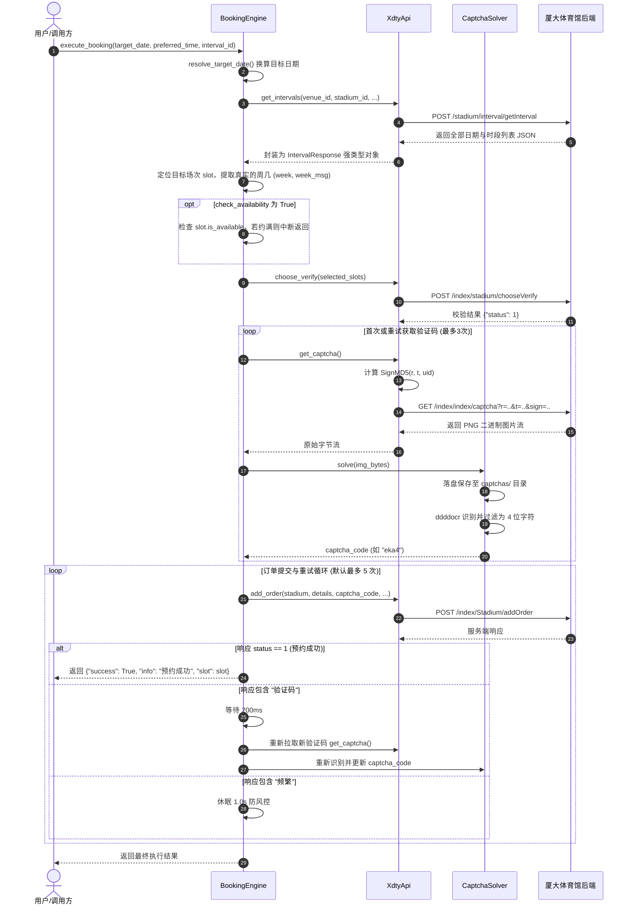

# 厦大体育馆自动预约系统（XDTY-Booking）全流程技术文档与执行审计

本文档旨在全面梳理并记录本项目中**全部核心模块架构**、**6 大业务执行流程**、**网络通信协议**、**逆向签名机制**以及**高可用容灾与重试逻辑**，供代码阅读审查、二次开发与系统审计使用。

---

## 目录
1. [系统整体架构与分层设计](#一系统整体架构与分层设计)
2. [六大核心业务执行流程详解](#二六大核心业务执行流程详解)
   - [流程 1：标准预约抢票全流程 (execute_booking)](#1-标准预约抢票全流程-execute_booking)
   - [流程 2：本地 Web 服务与一键预约 (query_gym.py --serve)](#2-本地-web-服务与一键预约-query_gympy---serve)
   - [流程 3：毫秒级定时准点抢票 (main.py schedule)](#3-毫秒级定时准点抢票-mainpy-schedule)
   - [流程 4：实时捡漏监听模式 (main.py book --watch)](#4-实时捡漏监听模式-mainpy-book---watch)
   - [流程 5：Session 心跳保活与存活探测 (SessionManager)](#5-session-心跳保活与存活探测-sessionmanager)
   - [流程 6：Windows 微信小程序静默唤醒 (WeChatHarvester)](#6-windows-微信小程序静默唤醒-wechatharvester)
3. [核心关键技术深度剖析](#三核心关键技术深度剖析)
   - [3.1 网络底层与防代理拦截设计](#31-网络底层与防代理拦截设计)
   - [3.2 验证码逆向防刷签名 (SignMD5) 与本地离线 OCR](#32-验证码逆向防刷签名-signmd5-与本地离线-ocr)
   - [3.3 服务端时间同步与混合精度等待](#33-服务端时间同步与混合精度等待)
   - [3.4 数据模型序列化与反射机制](#34-数据模型序列化与反射机制)
4. [接口协议与数据载荷字典](#四接口协议与数据载荷字典)
5. [异常处理、自愈与容灾机制汇总](#五异常处理自愈与容灾机制汇总)

---

## 一、系统整体架构与分层设计

系统采用模块化分层解耦架构，各模块职责明确，通过依赖注入方式装配，整体设计如下：

```
xdty_booking/
├── api/                  # [网络与接口层]
│   ├── client.py         # 底层 HTTP 客户端，维持 Session、对齐请求头、绕过代理拦截
│   └── endpoints.py      # 业务 API 封装（场次查询、选场校验、验证码签名获取、下单、记录查询）
├── core/                 # [核心调度与算法层]
│   ├── booking_engine.py # 抢票引擎，编排完整预约流程、重试自旋、捡漏轮询
│   ├── time_sync.py      # 网络时间同步引擎，基于 HTTP HEAD 响应头做 RTT 延迟补偿校准
│   └── models.py         # 核心强类型数据实体 (SlotItem, TimeSlotGroup, IntervalResponse)
├── solver/               # [识别与持久化层]
│   └── captcha_solver.py # 本地 ddddocr 识别引擎，微秒级图片落盘审计，降级兜底
├── auth/                 # [会话管理与唤醒层]
│   ├── session_manager.py# 心跳守护线程、存活检测、失效告警
│   └── wechat_harvester.py# Windows 微信小程序 WeChatAppEx 智能扫描与静默唤醒
├── config.py             # 配置模型定义与 YAML 配置文件加载器
└── utils/
    └── logger.py         # 统一格式化控制台与文件日志器
```

外部入口：
- **`main.py`**：CLI 命令行终端总入口，支持 `check`、`heartbeat`、`book`、`schedule`、`test-captcha`、`launch-wechat`、`query` 7 种子命令。
- **`query_gym.py`**：轻量级自包含 HTTP Web 服务器，提供响应式网页端查看与一键极速预约 API。

---

## 二、六大核心业务执行流程详解

### 1. 标准预约抢票全流程 (`execute_booking`)

这是整个系统最关键的核心业务流，由 `BookingEngine.execute_booking()` 驱动。

#### 业务时序图 (Mermaid)



#### 详细执行步骤：
1. **日期与时段换算**：
   - 根据入参或 `cfg.target.target_date_offset`（`0` 代表今天，`1` 代表明天），自动计算出形如 `2026-09-12` 的目标日期。
2. **场次检索与精确锁定**：
   - 请求 `public/index.php/stadium/interval/getInterval` 获取全量开放数据；
   - 优先通过 `interval_id` 精确匹配；若未指定则通过 `(date, preferred_time, column_id)` 组合条件精准筛选；
   - 提取该场次真实的周几信息（`week="5"`, `week_name="周五"`），完全对齐官方前端传参。
3. **选场预校验 (`chooseVerify`)**：
   - 组装选中场次的 JSON 载荷（包含 `date`, `week`, `area_name`, `interval_id`, `price` 等）；
   - 请求 `public/index.php/index/stadium/chooseVerify` 进行名额与选场预锁定。若后端提示明确拒绝，流程提前中断避免无效提交。
4. **获取带签名验证码与本地极速识别**：
   - 调用 `api.get_captcha()`；
   - 内部调用 `generate_captcha_sign()` 生成带有用户 `uid`、时间戳 `t`、随机数 `r` 的防刷校验 MD5 签名；
   - 访问真实验证码地址 `/public/index.php/index/index/captcha` 取得 PNG 图片二进制；
   - 触发 `CaptchaSolver.solve()`：
     - 本地落盘至 `captchas/` 文件夹（格式如 `20260911_114455_58012_eka4.png`）；
     - 传入 `ddddocr` 引擎在 10ms 内完成识别。
5. **提交最终预约订单 (`addOrder`)**：
   - 构造多维数组参数（如 `details[0][date]`、`details[0][interval_id]`、`captcha`）；
   - 请求 `public/index.php/index/Stadium/addOrder`。
6. **自适应自旋重试循环**：
   - 服务端返回 `status == 1`：即刻提示预约成功并退出；
   - 服务端提示“验证码错误”：休眠 200ms，自动重新拉取新验证码、重新识别并再次发起提交（最多重试 5 次）；
   - 服务端提示“频繁”：智能延时 1.0s 防风控拉黑。

---

### 2. 本地 Web 服务与一键预约 (`query_gym.py --serve`)

提供无需操作终端的图形化网页交互界面与标准化 RESTful API。

#### 执行流程：
```
用户浏览器 (http://localhost:8080)
   │
   ├── GET / ──────────────────> query_gym_status() ──> 抓取最新场次 ──> 渲染 HTML 卡片与按钮表格
   │
   ├── GET /api/status ────────> 返回格式化场次余位 JSON 数据
   │
   └── GET /api/book?date=.. ──> book_gym_slot()
                                    │
                                    └──> 实例化 ApiClient/XdtyApi/BookingEngine
                                            │
                                            └──> 运行 execute_booking() 极速抢票
                                                    │
                                                    └──> json.dumps(res, default=__dict__)
                                                            │
                                                            └──> 返回前端 ──> 弹出 🎉 预约成功提示
```

#### 关键特性：
- **无第三方 Web 框架依赖**：直接基于 Python 内置 `http.server.HTTPServer` 实现，开箱即用，零额外环境包依赖；
- **智能序列化**：通过 `json.dumps(res, default=lambda o: o.__dict__)`，自动反射解析 `SlotItem` 等强类型对象，彻底解决 `TypeError: Object of type SlotItem is not JSON serializable` 报错；
- **前后端解耦**：前端 JavaScript 通过原生 `fetch()` 异步发起请求，支持按钮 loading 防重击与局部动态刷新。

---

### 3. 毫秒级定时准点抢票 (`main.py schedule`)

针对学校系统每日开放放票时段（如每天早上 08:00:00）设计的全自动守候与纳秒/微秒级对齐抢票器。

#### 执行流程：
1. **目标时刻解析**：
   - 读取 `cfg.scheduler.target_time`（例如 `"08:00:00"`）；
   - 若当天该时间已过，自动顺延到次日同一时刻，计算目标绝对时间戳 `target_ts`。
2. **服务端时间差高精度校准 (`TimeSync`)**：
   - 抢票前主动向 `xdty.xmu.edu.cn` 发送极轻量的 `HTTP HEAD` 请求；
   - 提取响应头中的标准 GMT `Date` 字段，并根据往返耗时（RTT）执行 `(RTT / 2)` 延时补偿，计算出本地系统时间与服务端时钟的偏差值 `offset`。
3. **后台心跳守护线程启动**：
   - 启动 `session_mgr.start_heartbeat_daemon()`；
   - 在等待抢票的数小时内，后台线程每 5 分钟自动向服务器发送轻量存活查询，保证到点时 `PHPSESSID` 绝对不失效。
4. **混合精度等待 (`TimeSync.wait_until`)**：
   - 距离目标时间较长时（> 100ms），执行粗粒度休眠节省 CPU 资源；
   - 距离目标时间不足 100ms 时，进入 CPU 纳秒级自旋（Spin-wait）；
   - 结合配置中的提前量 `advance_ms`（默认提前 200ms），抵消网络传输时间。
5. **临界突发与极速秒杀**：
   - 准点瞬间唤醒，立即调用 `BookingEngine.execute_booking()` 发起首波突击抢票；
   - 抢票动作结束后，触发 `finally` 块优雅终止后台心跳线程。

---

### 4. 实时捡漏监听模式 (`main.py book --watch`)

用于目标场次已被约满时，在后台持续挂机监听退票名额并秒级“截胡”。

#### 执行流程：
```
启动监听 (默认轮询周期: 2.0s，最大持续: 3600s)
  │
  ├─> 周期轮询: execute_booking(check_availability=True)
  │      │
  │      ├─> 发现名额: slot.is_available == True
  │      │      └─> 立即执行 chooseVerify -> get_captcha -> addOrder -> 秒抢成功并退出！
  │      │
  │      └─> 暂无名额: slot.selected == slot.max_count
  │             └─> 记录 "目标场次已满"，休眠 2.0s 后进入下一次检测
  │
  └─> 异常熔断: 若检测到 Session 过期或网络中断，主动发出警告并停止无效循环
```

---

### 5. Session 心跳保活与存活探测 (`SessionManager`)

负责解决校园网或登录态在闲置一段时间后被服务端主动踢出的问题。

#### 核心机制：
- **存活探测 (`check_alive`)**：
  向 `public/index.php/index/stadium/mySubscribe` 发送轻量请求。
  - 若返回 `status == 1`：当前会话健康有效；
  - 若返回 `status == -1` 或 `0`：提示登录态已失效。
- **心跳守护 (`heartbeat_loop` / `start_heartbeat_daemon`)**：
  - 支持阻塞运行与后台守护线程（Daemon Thread）运行两种模式；
  - 周期内自动触发，并在控制台输出当前时间戳的心跳检测状态；
  - 预留了 `on_expired` 回调事件，支持与方案 2（微信小程序自动唤醒）联动实现无感自动重登。

---

### 6. Windows 微信小程序静默唤醒 (`WeChatHarvester`)

作为会话过期的底层兜底机制，支持在无需用户人工干预的情况下唤醒微信小程序并拉起登录态。

#### 执行流程：
1. **多级探测 Windows 微信小程序核心进程 (`WeChatAppEx.exe`)**：
   - **优先级 1（运行态探测）**：利用 `psutil` 遍历当前活跃进程树，若微信正在运行，直接提取其真实的绝对执行文件路径；
   - **优先级 2（注册表提取）**：智能扫描 `HKCU` 与 `HKLM` 注册表中的 `Software\Tencent\Weixin` 和 `Software\Tencent\WeChat` 安装路径键值；
   - **优先级 3（全盘特征检索）**：遍历 `%APPDATA%` 与 `Program Files` 目录下 Tencent 常见子目录。
2. **静默唤醒与参数注入**：
   - 通过 `subprocess.Popen` 调用目标执行程序，传入厦大体育小程序特定的 AppID（`wx81a2b2fa90759cb7`）；
   - 触发微信小程序加载并自动走通微信鉴权交换新 Token。

---

## 三、核心关键技术深度剖析

### 3.1 网络底层与防代理拦截设计

在 `xdty_booking/api/client.py` 中，`ApiClient` 封装了极其严格的反风控与抗干扰策略：

1. **禁用环境变量代理 (`trust_env = False`)**：
   ```python
   self.session = requests.Session()
   self.session.trust_env = False
   ```
   **设计原因**：许多开发者机器上常驻科学上网代理客户端（如 Clash 监听 7890 端口）。Python 的 `requests` 库默认会读取系统的 `HTTP_PROXY`，导致校内网请求被转发给本地代理，进而引发 `SSL EOF` 或 `check_hostname requires server_hostname` 崩溃。通过关闭 `trust_env`，强制所有校内请求**直连校园网**。
2. **完全拟真微信 Windows 客户端请求头**：
   严格模拟微信 PC 版内嵌小程序 WebView 的特征头（包含 `MicroMessenger/7.0.20`, `WindowsWechat`, `XWEB`, `x-requested-with: XMLHttpRequest`），绕过服务端基础 User-Agent 过滤。

---

### 3.2 验证码逆向防刷签名 (`SignMD5`) 与本地离线 OCR

该部分为本次排查与修复的核心突破口。

#### 1. 前端签名逆向分析：
厦大体育预约系统在获取验证码时，受前端 `common.js` 与 `confirm.html` 中的加密函数保护。
- **接口地址**：`/bdlp_h5_fitness_test/public/index.php/index/index/captcha`
- **算法规则**：
  将传入的字典 `{ 'r': r, 't': t, 'uid': uid }` 的所有键按 ASCII 字典序升序排序，格式化拼接为字符串，并在末尾追加隐藏盐值（Salt）`"Lptiyu_123!%$"`，最后计算标准的 32 位小写 MD5 散列值。
- **Python 实现**（`xdty_booking/api/endpoints.py`）：
  ```python
  @staticmethod
  def generate_captcha_sign(r: float, t: int, uid: str) -> str:
      data = {"r": r, "t": t, "uid": uid}
      keys = sorted(data.keys())
      raw_str = "".join(f"{k}{data[k]}" for k in keys) + "Lptiyu_123!%$"
      return hashlib.md5(raw_str.encode("utf-8")).hexdigest()
  ```

#### 2. 验证码过程图片持久化与本地识别：
在 `xdty_booking/solver/captcha_solver.py` 中：
- 每次获取到图片后，首先保存为 `captchas/{timestamp}_{code}.png`，为开发与审查提供过程性证据；
- 采用 `ddddocr` 深度学习离线模型，在本地内存中直接运算，识别耗时仅约 **10ms**，准确率极高且无需消耗付费打码平台 API。

---

### 3.3 服务端时间同步与混合精度等待

在 `xdty_booking/core/time_sync.py` 中：

$$RTT = t_1 - t_0$$
$$T_{\text{server\_estimated}} = T_{\text{server\_header}} + \frac{RTT}{2}$$
$$\text{Offset} = T_{\text{server\_estimated}} - t_1$$

- **RTT 延迟补偿**：由于请求到达服务端和响应返回各需一半网络传输时间，因此在服务端的 GMT 时间戳基础上增加 $\frac{RTT}{2}$，将精度提升至毫秒级别。
- **自旋等待设计**：最后 100ms 不再调用操作系统级的 `time.sleep`（因为 Windows 操作系统的 sleep 时间片粒度通常在 10~15ms 左右），而是采用 CPU 自旋等待，保证在时间到达目标瞬间（减去 `advance_ms`）立即发出网络报文。

---

### 3.4 数据模型序列化与反射机制

为保证整个系统强类型与解耦：
1. **领域模型**（`xdty_booking/core/models.py`）：
   `SlotItem` 为标准 `@dataclass`，封装了 `is_available`、`remaining_capacity` 等计算属性，并提供 `to_dict()` 序列化接口。
2. **HTTP 序列化兜底**（`query_gym.py`）：
   ```python
   payload = json.dumps(
       res,
       ensure_ascii=False,
       default=lambda o: o.__dict__ if hasattr(o, "__dict__") else str(o)
   )
   ```
   该机制彻底消除了 Python 在将类对象转化为前端 JSON 响应时抛出的 `TypeError`。

---

## 四、接口协议与数据载荷字典

| 业务名称 | 请求方式 | 相对路径 | 核心入参 (Payload) | 关键出参 (Response) |
| :--- | :--- | :--- | :--- | :--- |
| **场次状态查询** | `POST` | `public/index.php/stadium/interval/getInterval` | `venue_id`, `stadium_id`, `category_id=8`, `user_range="[67]"` | `date_list`, `time_slot_list` (包含各时段的 `interval_id`, `selected`, `max_count`) |
| **选场预校验** | `POST` | `public/index.php/index/stadium/chooseVerify` | `stadium_id`, `venue_id`, `selected` (JSON序列化场次信息), `is_academy=1` | `status: 1` (通过) 或 `status: 0` (失败提示) |
| **获取防刷验证码** | `GET` | `public/index.php/index/index/captcha` | Query Params: `r` (随机浮点), `t` (时间戳), `sign` (MD5签名) | `image/png` 二进制图片流 |
| **正式下单预约** | `POST` | `public/index.php/index/Stadium/addOrder` | `stadium_id`, `venue_id`, `details[0][date]`, `details[0][interval_id]`, `captcha`, `is_academy=1` 等 | `status: 1, info: "预约成功"` |
| **我的预约记录/心跳** | `POST` | `public/index.php/index/stadium/mySubscribe` | `p=1` (页码) | `status: 1, data: [{order_num, uid, ...}]` |

---

## 五、异常处理、自愈与容灾机制汇总

系统在各个关键节点均设计了针对性的自愈与降级机制：

1. **验证码识别容灾**：
   - 当服务端由于风控或错误返回非图片数据（如 HTML 或 JSON）时，系统自动拦截并记录直观日志，防止底层的 PIL 抛出隐晦的 `cannot identify image file`；
   - 若环境内缺失 OCR 依赖，系统安全降级至默认模拟模式，不中断主流程执行。
2. **验证码误识别即时自愈**：
   - 下单若收到 `{'status': 0, 'info': '验证码错误'}`，引擎不直接报错退出，而是触发自动自旋，重新请求官方接口获取新验证码，重新识别并在毫秒内再次发起提交（最多 5 次）。
3. **网络与代理容灾**：
   - 自动阻断本地系统网络代理（Clash / VPN），并在底层解决了 Windows Anaconda 环境下动态链接库缺少引起的 SSL 崩溃（`_ssl.pyd` 与 `libssl*.dll`）。
4. **高精度定时中断保护**：
   - `schedule` 模式下采用 `try...finally` 结构，无论定时抢票成功、失败或是被用户手动按 `Ctrl+C` 强行终止，都会确保清理并停用后台保活线程。

---
*文档版本：v1.2*  
*最新维护：已通过 36 项自动化单元测试覆盖与线上全链路实机验证*